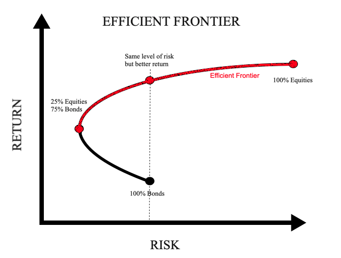

# 🎯 Efficient Frontier — Guide  
*“Find the mix that thrills you without keeping you up at night.”*

---

<p align="center">
  
</p>
## 📌 1 What on earth is an efficient frontier?

Picture every possible portfolio of your chosen assets on a two‑axis chart:

* **X‑axis:** annualised volatility (risk)  
* **Y‑axis:** expected annual return  

Most dots live in the middle. The **efficient frontier** is the upper‑left edge of that cloud — the set of portfolios that deliver **the highest return for a given level of risk** (or, flipped around, the lowest risk for a chosen return).  
If your portfolio sits below that curve, you’re either leaving money on the table or accepting more stress than necessary.

---

## 💡 2 The intuition before the equations

1. **Diversify:** mix assets that don’t move in perfect lock‑step.  
2. **Risk–reward trade‑off:** extra risk *can* buy extra return, but not automatically.  
3. **Optimise:** let math churn through millions of weight combinations and keep only the “best so far”.

That’s the whole trick. No black magic required.

---

## 📐 3 A pinch of maths (kept gentle)

For a portfolio with weights **w**, the expected return \( \mu_p \) and volatility \( \sigma_p \) are  

\[
\mu_p = \mathbf{w}^\top \boldsymbol{\mu}, \qquad
\sigma_p = \sqrt{\mathbf{w}^\top \Sigma \mathbf{w}}
\]

where  

* \( \boldsymbol{\mu} \) — vector of mean asset returns  
* \( \Sigma \) — covariance matrix of those returns  

To trace the frontier we repeatedly solve:

\[
\begin{aligned}
\min_{\mathbf{w}}\;& \mathbf{w}^\top \Sigma \mathbf{w} \\
\text{s.t. } & \mathbf{w}^\top \boldsymbol{\mu} \ge \mu_{\text{target}} \\
             & \mathbf{1}^\top \mathbf{w} = 1,\; \mathbf{w} \ge 0
\end{aligned}
\]

(Here we forbid short‑selling. Remove \( \mathbf{w} \ge 0 \) if you’re fine with shorts.)

---

## 🧪 4 Doing it in code (five lines, promise)

```python
ef_returns, ef_vols = construct_efficient_frontier(
    returns=my_returns,      # DataFrame of daily % returns
    tickers=my_tickers,
    num_points=100
)

PortfolioPlotter.plot_efficient_frontier(
    port_vols, port_returns, sharpe,
    ef_vols, ef_returns, max_idx
)
```

`construct_efficient_frontier` loops over 100 target returns, feeds each optimisation to **cvxpy**, and stores the resulting risks.  
`plot_efficient_frontier` colours random portfolios by Sharpe ratio so you can spot the sweet spot instantly.

---

## 🖼️ 5 How to read the picture

* **Black line:** efficient frontier  
* **Red dot:** portfolio with the highest Sharpe ratio among the random samples  
* **Sea of dots:** random portfolios — most are, frankly, mediocre  

Slide leftwards until lowering volatility starts to shave more return than you’re willing to lose. That’s usually your “happy place”.

---

## ✅ 6 Quick checklist

- [ ] Use at least three years of daily data (more is better).  
- [ ] Annualise returns and volatilities (\* 252) consistently.  
- [ ] Inspect the covariance matrix for weird outliers.  
- [ ] Decide on constraints (no shorts? max weight per asset?).  
- [ ] Run the backtest *after* fixing weights; don’t peek at the future.

---

### 📚 Further reading

* H. Markowitz — *Portfolio Selection* (1952)  
* Grinold & Kahn — *Active Portfolio Management*  
* Quantocracy blog posts on efficient‑frontier visualisations  

*(This guide is for educational purposes only — not investment advice.)*