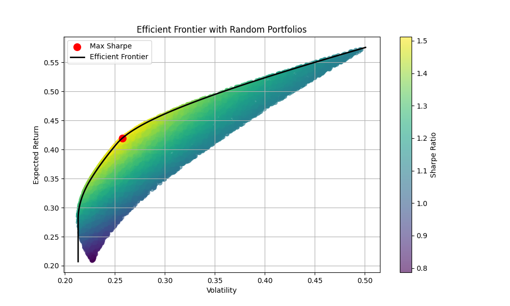

# 📈 Portfolio Optimisation — An Investor’s Journey

> 💬 “Compound interest is the eighth wonder of the world.”  
> — *attributed to Albert Einstein*

---

  

## 🌱 Why this project exists

This project didn’t begin in a finance lab or on Wall Street.  
It started from watching a friend build something cool — a portfolio analysis tool — and thinking:

**“Maybe it’s time I tried building one too.”**

I’ve always been curious about investing and quant strategies, but this time I wanted to go deeper.  
Not just reading or paper-trading — but writing code, testing ideas, and learning by doing.

This repo is my way of exploring portfolio optimisation,  
and improving both my coding skills 🧠 and financial understanding 💰 along the way.

---

## 📦 What you’ll find inside

1. 🛠️ **Walk‑Through** — a practical guide from setup to running your first backtest  
2. 📊 **Results & Charts** — things like the Efficient Frontier, portfolio stats, and benchmark comparisons  
3. 📚 **References** — research papers, blog posts, and tools that helped along the way

> 🧪 *Everything here is reproducible — no magic, just code.*

---

## 🤝 A quick promise

This project is written in *plain English*, with minimal jargon.  
If something’s confusing or unclear, open an issue or send feedback — I’ll happily improve it.

---

### 🚀 Let’s get started

Fire up a notebook, run some numbers,  
and see how far a little curiosity and consistency can take us.

**Happy compounding!** ☕📘📈