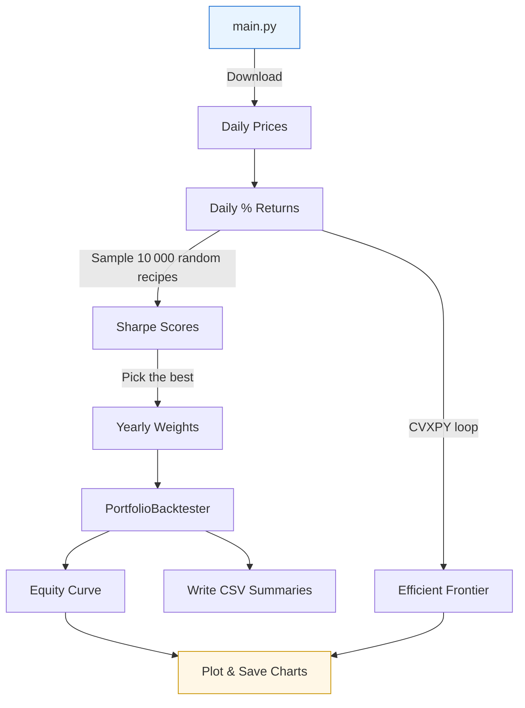

# 📘 Portfolio Optimisation — Walk‑Through  
*Build, test and understand a simple stock portfolio in Python.*

---

## Table of Contents    

- [📘 Portfolio Optimisation — Walk‑Through](#-portfolio-optimisation--walkthrough)
  - [Table of Contents    ](#table-of-contents--)
  - [👋 Welcome](#-welcome)
  - [🛠️ What We’re Building](#️-what-were-building)
  - [🧰 Tools in the Toolbox](#-tools-in-the-toolbox)
  - [⚙️ How the Strategy Works](#️-how-the-strategy-works)
  - [🧮 Key Equations](#-key-equations)
  - [🧵 The Code — Step by Step](#-the-code--step-by-step)
  - [💡 Code Nuggets](#-code-nuggets)
  - [📊 Results at a Glance](#-results-at-a-glance)
  - [🚀 Run It Yourself](#-run-it-yourself)

---

## 👋 Welcome  

If you’ve ever wondered **how** people pick a mix of stocks and test it on past data, this guide is for you. We’ll start with ten well‑known companies and show — with code — how to: choose a mix of stocks each year, test it on past data, and compare the outcome to the S&P 500 ETF (*SPY*). No PhD or heavy maths required — just curiosity and some Python.

---

## 🛠️ What We’re Building  

* **Goal:** Grow money over the long run while minimizing wild swings.  
* **Universe:** Ten large‑cap US stocks (Apple, Microsoft, Amazon, etc.).  
* **Tactic:** Once a year, find the weights that gave the best risk‑adjusted return (*Sharpe Ratio*) over the past 12 months, then hold those weights for the next year.  
* **Benchmark:** *SPY*, the go‑to yard‑stick for US equities.

---

## 🧰 Tools in the Toolbox  

| Tool | Why we use it |
|------|---------------|
| **VectorBT** | Quickly downloads price data from Yahoo Finance. |
| **NumPy / Pandas** | Crunch numbers and wrangle data frames. |
| **CVXPY** | Solves the optimisation problem that draws the *efficient frontier*. |
| **Matplotlib** | Plots equity curves and other charts. |

Everything runs on plain Python 3.10+; nothing fancy to install.

---

## ⚙️ How the Strategy Works  

Picture a recipe book. Each **recipe** is a set of weights that tells us how much Apple, Microsoft, Amazon … to put in the pot. We want the recipe that offered the **tastiest return per unit of risk** last year.

*Risk* here is day‑to‑day ups and downs (*volatility*). The taste‑test score is the **Sharpe Ratio**:

\[
\text{Sharpe} = \frac{\text{Average daily return} \times 252 - r_f}{\text{Daily volatility} \times \sqrt{252}}
\]

…where \(r_f\) is the tiny “free” return you could have earned in cash (we use 3 %).

Once we have that recipe, we cook with it for a year, then repeat the process.

---

## 🧮 Key Equations  

Here are the handful of formulas you will see over and over in portfolio theory. MathJax is enabled, so feel free to copy‑paste these into your own notes.  

$$
  \mu_p = \mathbf{w}^\top \boldsymbol{\mu}
$$

$$
  \sigma_p = \sqrt{\mathbf{w}^\top \Sigma \,\mathbf{w}}
$$

$$
  \min_{\mathbf{w}} \;\sigma_p
  \quad\text{s.t.}\quad
  \begin{cases}
    \mathbf{w}^\top \boldsymbol{\mu} \;\ge\; \mu_{\text{target}} \\
    \sum_{i=1}^{N} w_i = 1 \\
    w_i \ge 0 \quad \forall i
  \end{cases}
$$

$$
  \text{CVaR}_{95\%} = -\frac{1}{N_{tail}}\sum_{i \in \text{worst }5\%} r_i
$$

$$
  \sum_{i=1}^{N} w_i^2 \xrightarrow{} 0
  \quad\text{implies a well‑diversified portfolio}
$$
(That last one is the *Herfindahl index* we plot each year.)

---

## 🧵 The Code — Step by Step  



1. **Get the data** from Yahoo Finance.  
2. **Generate 10 000 random weight vectors** with a Dirichlet distribution.  
3. **Score** each weight set by its Sharpe Ratio.  
4. **Keep** the top‑scoring weights.  
5. **Test** those weights on the actual returns for that year.  
6. **Stitch together** the yearly equity curves to form one long curve.  
7. **Compare** that curve with *SPY* and save everything (plots + CSV) in the `reports/` and `exports/` folders.

---

## 💡 Code Nuggets  

Sometimes you just want to see *one* self‑contained example. The snippet below shows **how we solve one point on the Efficient Frontier**.  

```python
import cvxpy as cp

# mus and cov are taken from historical returns
w = cp.Variable(len(tickers))
risk = cp.quad_form(w, cov)

prob = cp.Problem(
    cp.Minimize(risk),
    [
        cp.sum(w) == 1,      # fully invested
        w >= 0,              # long‑only
        mus @ w >= target    # hit desired return
    ]
)
prob.solve()

print("Weights:", w.value.round(4))
print("Portfolio σ:", (risk.value ** 0.5).round(4))
```

👉 **Tip:** swap `cp.Minimize(risk)` for `cp.Maximize(sharpe)` if you feel adventurous.  
(Just remember to define the Sharpe expression first!)

---

## 📊 Results at a Glance  

After running `main.py` you’ll find:

* **Equity & Drawdown Plot** – see growth and the worst dips.  
* **Efficient Frontier Plots** – one fancy curve per year.  
* **CSV summaries** – handy for spreadsheets or deeper analysis.

*(Files land in `reports/` and `exports/`. Feel free to open them and poke around.)*

---

## 🚀 Run It Yourself  

```bash
# 1. Grab the code.
git clone https://github.com/your_user/portfolio-opt.git
cd portfolio-opt

# 2. Install requirements (about 1–2 min).
poetry install  # or: pip install -r requirements.txt

# 3. Launch the pipeline.
poetry run python main.py
```

**Tinker Time**  
Open `main.py` to:

* swap in different tickers.  
* widen the date range.  
* change the number of random portfolios (`n_ports`).

Then hit **Run** again and see how the story changes.

---

*Happy exploring, and may your portfolios be ever in your favour!* 🎉
